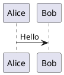
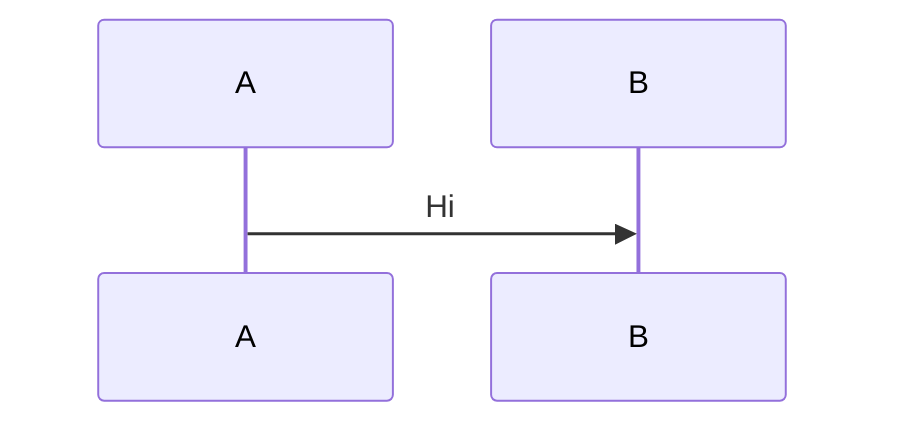

# Lark Markdown to Doc

## 概览

以 Markdown 为输入，通过 lark-cli 分段写入飞书文档，并在遇到指令块时自动创建高亮块或画板并导入图表。

## 工作流（Markdown → 飞书文档）

1. 准备 Markdown 输入（文件路径）。
2. 选择写入目标：已有文档 `--doc-id` 或新建文档 `--title`。
3. 使用脚本解析指令块并调用 lark-cli 渲染。
4. 用 `get-content/get-blocks` 复核结构，必要时迭代。

## 脚本：Markdown 分段渲染

使用 `scripts/render_lark_doc.py` 读取 Markdown，按段调用 lark-cli：

```bash

注意：
1. 不能 cd 到技能目录，必须在工作/仓库目录下执行。
2. 输出文档与 `assets/` 必须写入工作/仓库目录，禁止写入技能目录（例如 `~/.xxx/skills/...`）。

# 创建新文档并渲染
python3 scripts/render_lark_doc.py --md ./doc.md --title "文档标题" [--folder-token <token>]

# 渲染到已有文档
python3 scripts/render_lark_doc.py --md ./doc.md --doc-id <DOC_ID>
```

指令块语法：

````markdown




```callout type=warning
这里是高亮块内容
```
````

说明：

- `plantuml` / `mermaid` 会自动创建画板并导入图表。
- `callout` 会创建高亮块；可选参数：`type=info|warning|error|success`。
- 非指令块的普通代码块会按原样写入 Markdown。

## 模板与参考

- 通用 Markdown 模板：`assets/markdown-template.md`
- PlantUML 安全子集：`references/plantuml-safe.md`
- 渲染脚本：`scripts/render_lark_doc.py`
