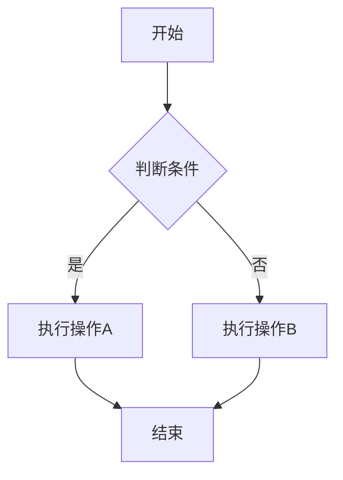

# Lark Doc to Obsidian

将飞书云文档导出为 Obsidian 格式的 Markdown，**支持画板自动转换为 Mermaid 代码**。

## 特性

- ✅ 完整的块结构解析（标题、正文、列表、代码、表格等）
- ✅ 图片与画板下载到 `assets/` 目录
- ✅ Obsidian 格式引用 `![[assets/xxx.png]]`
- ✅ **画板转 Mermaid**：使用火山方舟 LLM 智能转换画板
  - 支持流程图、时序图、状态图、ER图、里程碑图等
  - 10 线程并发转换，速度提升 10 倍
  - 智能降级：复杂图表保留原图片
- ✅ 完整的日志记录，便于调试

## 快速开始

### 基本使用

```bash
# 使用文档 URL 导出
python3 skills/lark-doc-to-obsidian/scripts/lark_doc_to_obsidian.py \
  --doc-url "https://bytedance.larkoffice.com/wiki/THs7wBWnwiyZXEkvcyxcPBGEncf" \
  --out ./output.md

# 使用 doc_id 导出
python3 skills/lark-doc-to-obsidian/scripts/lark_doc_to_obsidian.py \
  --doc-id <DOC_ID> \
  --out ./output.md

# 自定义 assets 目录
python3 skills/lark-doc-to-obsidian/scripts/lark_doc_to_obsidian.py \
  --doc-url "https://bytedance.larkoffice.com/docx/<DOC_ID>" \
  --out ./output.md \
  --assets ./my-assets
```

### 启用画板转 Mermaid（可选）

#### 1. 配置火山方舟 API

```bash
# 设置 Model ID（Endpoint ID）
node scripts/config.js set volcano.model_id ep-xxx-xxx

# 设置 API Key
node scripts/config.js set volcano.api_key xxxx

# 查看当前配置
node scripts/config.js get
```

配置文件位置：`~/.my-plugins/lark-doc-to-obsidian.json`

#### 2. 获取火山方舟 API

1. 访问 [火山方舟控制台](https://console.volcengine.com/ark)
2. 开通视觉模型（推荐 `doubao-1.5-vision-pro-32k`）
3. 创建推理接入点，获取 Endpoint ID
4. 生成 API Key

详细文档：https://www.volcengine.com/docs/82379/1362931

## 支持的图表类型

| 图表类型 | Mermaid 类型 | 说明 |
|---------|--------------|------|
| 流程图/架构图 | `flowchart` | 支持复杂架构，50+ 节点 |
| 时序图 | `sequenceDiagram` | 时序交互流程 |
| 状态图 | `stateDiagram-v2` | 状态机转换 |
| ER图 | `erDiagram` | 实体关系模型 |
| 里程碑图 | `flowchart` + 样式 | 项目时间轴 |
| 泳道图 | `flowchart` + `subgraph` | 垂直/水平泳道 |

## 输出示例

### 成功转换为 Mermaid

````markdown

<!-- 原画板: ![[assets/xxx.png]] -->
````

### 无法转换时（降级为图片）

```markdown
![[assets/xxx.png]]
```

## 性能优化

### 并发转换

- **默认 10 线程并发**：多画板文档速度提升 10 倍
- **进度实时显示**：`[Progress] 3/10 boards processed`
- **智能缓存**：转换结果自动缓存，避免重复调用

### 性能对比

假设 10 个画板的文档：

| 模式 | 耗时 | 说明 |
|------|------|------|
| 串行转换 | 600秒（10分钟） | 10 × 60秒 |
| 并发转换（10线程） | 60秒（1分钟） | 同时处理 10 个 |

## 配置选项

### 环境变量

```bash
# LLM 超时时间（秒）
VOLCANO_LLM_TIMEOUT=90

# 并发转换线程数
MAX_CONCURRENT_BOARD_CONVERSION=10
```

### CLI 参数

```bash
--doc-id <DOC_ID>          # 文档 ID
--doc-url <DOC_URL>        # 文档 URL
--out <OUTPUT_PATH>        # 输出 Markdown 路径（必选）
--assets <ASSETS_DIR>      # Assets 目录（默认：<out_dir>/assets）
--language-map <JSON_PATH> # 代码语言映射 JSON（可选）
--no-download              # 不下载资源（可选）
```

## 目录结构

```
lark-doc-to-obsidian/
├── .claude-plugin/
│   └── plugin.json          # 插件配置
├── hooks/
│   └── hooks.json           # SessionStart 钩子
├── scripts/
│   ├── config.js            # 配置管理工具
│   └── check-config.js      # 配置检查脚本
└── skills/lark-doc-to-obsidian/
    ├── SKILL.md             # 技能文档
    ├── references/          # 参考文档
    │   ├── language.md      # 语言枚举表
    │   └── 飞书文档块结构.md
    └── scripts/
        ├── volcano_llm.py   # 火山 LLM 调用模块
        ├── renderer.py      # 渲染器（含并发转换）
        ├── lark_cli.py      # 飞书 CLI 封装
        ├── doc_utils.py     # 文档工具
        ├── md_utils.py      # Markdown 工具
        └── language_map.py  # 代码语言映射
```

## 转换规则

- **文档标题**：page 块的 title 输出为首行一级标题
- **标题/正文/列表/引用/代码**：按块类型转换为标准 Markdown
- **@用户**：解析为 `@名字`；失败则回退为 `@user_id`
- **Callout**：转为 Markdown 引用块，首行带 `**提示**`
- **图片**：下载到 `assets/`，Obsidian 格式引用
- **画板/图表**：
  - 优先尝试 LLM 转换为 Mermaid（需配置）
  - 无法转换时使用图片引用
- **表格**：
  - 简单表格 → Markdown 表格
  - 复杂表格（`row_span/col_span > 1`）→ HTML table

## 日志

LLM 响应日志保存在：`~/.my-plugins/logs/lark-doc-to-obsidian/`

日志文件命名：`<timestamp>_<token>.json`

包含内容：
- 请求信息（模型、参数）
- 响应信息（ID、模型、Token 使用量）
- LLM 返回的原始内容
- 提取的 Mermaid 代码

## 常见问题

### Q: 画板没有转换为 Mermaid？

**A**: 检查以下几点：
1. 是否配置了火山 LLM API：`node scripts/config.js get`
2. 查看日志输出，确认 LLM 客户端是否初始化
3. 检查画板是否过于复杂（节点超过 50 个或包含自由绘制）

### Q: 转换速度很慢？

**A**:
1. 已启用 10 线程并发，单画板转换约 60 秒
2. 可查看日志确认是否有网络超时
3. 关闭 thinking 模式已节省大量时间（相比开启前节省 24% token）

### Q: 转换结果不准确？

**A**:
1. LLM 转换可能不是 100% 准确
2. 可以手动编辑生成的 Mermaid 代码
3. 原图片路径保存在注释中，可随时恢复

### Q: 如何禁用画板转 Mermaid？

**A**:
```bash
# 删除配置文件
rm ~/.my-plugins/lark-doc-to-obsidian.json

# 或清空 API Key
node scripts/config.js set volcano.api_key ""
```

## 依赖

### Python 依赖

使用 Python 标准库，**无需安装任何第三方依赖**。

### 系统依赖

- Python 3.6+
- `lark-cli` 命令行工具

## License

MIT

## 作者

DreamCats <maifeng@bytedance.com>

## 相关链接

- [火山方舟文档](https://www.volcengine.com/docs/82379/1362931)
- [Mermaid 官方文档](https://mermaid-js.github.io/)
- [Obsidian 官网](https://obsidian.md/)
