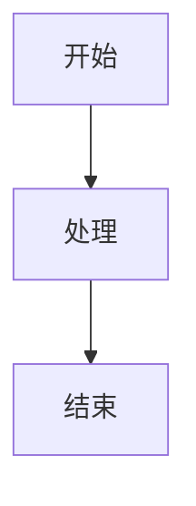

# Lark Doc to Obsidian Markdown

## 概览

从飞书云文档导出 Obsidian 格式的 Markdown：

- 通过 `get-blocks` 拉取块结构（保持 children 顺序）。
- 解析块类型并转换为 Obsidian 格式的 Markdown。
- 图片与画板缩略图下载到 `assets/`，使用 Obsidian 格式引用。
- **画板转 Mermaid**：可选使用火山 LLM 将画板/流程图/图表转换为 Mermaid 代码（需配置）。

## 依赖命令

- `lark-cli get-blocks <DOCUMENT_ID> --all`
- `lark-cli get-node <WIKI_TOKEN>`（当 doc_url 为 /wiki/ 链接时）
- `lark-cli get-user-info <USER_ID>`（当解析 @用户 时）
- `lark-cli download-media <FILE_TOKEN> <OUTPUT_PATH>`
- `lark-cli get-board-image <WHITEBOARD_ID> <OUTPUT_PATH>`

## 脚本用法

注意：

1. 不能 cd 到技能目录，必须在工作/仓库目录下执行。
2. 输出文档与 `assets/` 必须写入工作/仓库目录，禁止写入技能目录（例如 `~/.xxx/skills/...`）。

```bash

# 使用 doc_id 导出
python3 scripts/lark_doc_to_obsidian.py --doc-id <DOC_ID> --out ./output.md

# 使用 doc_url 导出（自动解析 doc_id；/wiki/ 链接会自动调用 get-node）
python3 scripts/lark_doc_to_obsidian.py --doc-url "https://bytedance.larkoffice.com/docx/<DOC_ID>" --out ./output.md

# 自定义 assets 目录
python3 scripts/lark_doc_to_obsidian.py --doc-id <DOC_ID> --out ./output.md --assets ./assets

# 传入语言映射 JSON（可选）
python3 scripts/lark_doc_to_obsidian.py --doc-id <DOC_ID> --out ./output.md --language-map ./language_map.json
```

## 画板转 Mermaid 功能（可选）

### 配置火山 LLM API

要启用画板转 Mermaid 功能，需要配置火山方舟的 API：

```bash
# 设置 Model ID（Endpoint ID）
node scripts/config.js set volcano.model_id ep-xxx-xxx

# 设置 API Key
node scripts/config.js set volcano.api_key xxxx

# 查看当前配置
node scripts/config.js get
```

配置文件位置：`~/.my-plugins/lark-doc-to-obsidian.json`

### 转换规则

当配置了火山 LLM API 后，画板处理逻辑如下：

1. **自动转换**：尝试将画板缩略图发送给 LLM 转换为 Mermaid 代码
2. **支持的图表类型**：
   - 流程图 (flowchart)
   - 时序图 (sequence)
   - 状态图 (state)
   - ER图 (er)
   - 思维导图 (mindmap)
3. **降级处理**：如果图表过于复杂（自由绘制、节点过多等），保留原图片引用

### 输出示例

成功转换为 Mermaid：

````markdown


<!-- 原画板: ![[assets/xxx.png]] -->
````

无法转换时：

```markdown
![[assets/xxx.png]]
```

## 转换规则（核心）

- **文档标题**：page 块的 title 会输出为首行一级标题（如首个子块已是同名标题则不重复）。
- **标题/正文/列表/引用/代码**：按块类型转换为标准 Markdown。
- **@用户**：解析为 `@名字`；如失败则回退为 `@user_id`。
- **Callout**：转为 Markdown 引用块，首行带 `**提示**`。
- **图片**：`download-media` 下载到 `assets/`，文件名使用 token，Obsidian 格式引用 `![[图片路径]]`。
- **画板/流程图/图表**：
  - **优先**：尝试使用 LLM 转换为 Mermaid 代码（需配置）
  - **降级**：无法转换时使用 `get-board-image` 下载缩略图，Obsidian 格式引用 `![[图片路径]]`。
- **表格**：
  - 简单表格 → Markdown 表格
  - 复杂表格（`row_span/col_span > 1`）→ HTML table
  - 表格内图片使用 ``，默认 `max-width:160px` 等比例缩放

## 参考文档

- 块结构参考：`references/飞书文档块结构.md`

## 语言映射

代码块语言由 `code.style.language` 的数值决定，脚本内置映射位于 `scripts/language_map.py`；如需覆盖，可传入 `--language-map` JSON。

语言枚举表参考：`references/language.md`（仅供人工查阅）

JSON 示例：

```json
{
  "28": "json",
  "1": "text"
}
```
