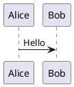
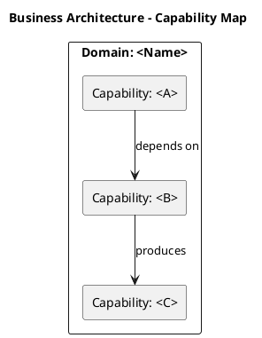
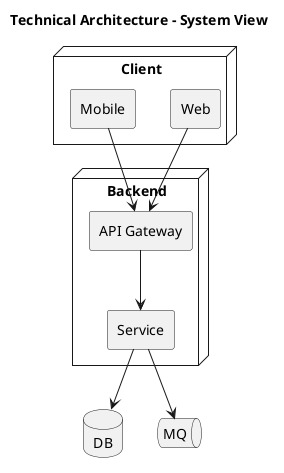
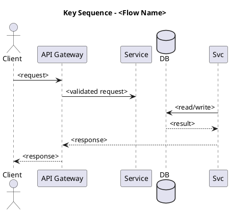
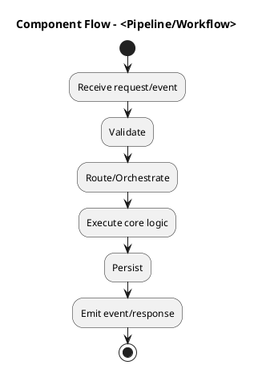

# Write Lark Markdown

## Overview

This skill helps you write consistent Markdown documents that are ready to render into Lark docs.

Hard constraints:

- Diagrams are **PlantUML-only** (no Mermaid).
- Use `callout` blocks heavily for executive readability.
- Non-instruction code fences are preserved as-is.

## When to use

- You want a doc that reads well for both engineering and exec audiences.
- You want consistent structure and reviewable diagrams.
- You want to standardize doc styles across a team.

## Example

- Full `tech-design` example: `assets/example-tech-design.md`
- Full `howto` example: `assets/example-howto.md`
- Full `research` example: `assets/example-research.md`
- Full `proposal` example: `assets/example-proposal.md`

## Supported styles

- `tech-design` (default)
- `howto`
- `research`
- `proposal`

## Parameters (recommended)

- `style`: `tech-design|howto|research|proposal` (default: `tech-design`)
- `audience`: `exec|eng|mixed` (default: `mixed`)
- `diagram_density`: `low|medium|high` (default: per-style)
  - `tech-design=high`, `howto=medium`, `research=low`, `proposal=low`
- `callout_density`: `low|medium|high` (default: `high`)

### Feature switches

All switches are boolean (`true|false`).

For `tech-design`:

- `include_alternatives` (default: true)
- `include_rollout` (default: true)
- `include_observability` (default: true)
- `include_security` (default: true)
- `include_performance` (default: true)
- `include_cost` (default: true)
- `include_open_questions` (default: true)
- `include_appendix_models` (default: false)
  - When `true`, include **at least one** of: Data Model (class) OR State (state), whichever best fits.
- `include_ai_image` (default: false)
  - When `true`, you may suggest using `ark-generate-image` to generate an optional executive image.
  - Suggested workflow: download the returned URL into a doc-local `./assets/` folder and reference it via a relative Markdown image link.
  - Even if you include an image, PlantUML remains the source of truth.

## Instruction blocks

This skill assumes downstream tooling (like `lark-md-to-doc`) recognizes these blocks.

````markdown


```callout type=warning
This is a highlighted block.
```
````

Rules:

- `callout` creates a Lark highlight block.
  - `type=info|warning|error|success`
  - Markdown tables are **not supported inside** callout blocks. If you need a table, put it immediately after the callout as normal Markdown.
- Non-instruction fences are kept as-is.

## AI image workflow (optional)

If you choose to add AI-generated illustrative images (for exec readability), treat them as optional decoration.

Rules:

- Use `ark-cli generate ... --format json` and take the returned `Url` as a download link.
- Download the image to a doc-local folder next to your Markdown file:
  - Option A: download yourself with `curl -L -o ./assets/<name>.jpeg "<Url>"`
  - Option B: use the helper: `python3 skills-plugins/write-lark-markdown/skills/write-lark-markdown/scripts/download_image.py --url "<Url>" --doc-dir . --name <name>.jpeg`
- Reference it in Markdown using a relative path:


```markdown

```

Note:

- `lark-md-to-doc` writes Markdown by segments; local image rendering depends on the downstream renderer. Keep PlantUML diagrams as the canonical, reviewable source of truth.

## PlantUML policy (strict)

- All diagrams MUST be written as:

```plantuml
@startuml
...
@enduml
```



- Mermaid is forbidden. If given Mermaid, rewrite it into PlantUML.
- Use the safe subset in `references/plantuml-safe-subset.md`.

## Templates

### style=tech-design

#### TL;DR (fixed 3-part format)

Must be the first section and must be wrapped by `callout type=info`.

```callout type=info
## TL;DR

**Conclusion**
<1-3 sentences: what we decide, why now, and what outcome we expect>

**Key Metrics**
- Owner: <name/team>
- Decision Needed: <who approves what>
- User/Business Impact: <metrics/impact or TBD + how to get it>
- Engineering Impact: <services touched / migration scope>
- Estimated Cost: <eng days / infra cost>
- Timeline: <milestones>
- Key Risks: <1-line list>
- Rollback Strategy: <how to rollback + trigger>

**Top Risks**
- <Risk 1> — Impact: ...; Mitigation: ...; Rollback trigger: ...
- <Risk 2> — Impact: ...; Mitigation: ...; Rollback trigger: ...
- <Risk 3> — Impact: ...; Mitigation: ...; Rollback trigger: ...
```

Immediately after the TL;DR callout, add a normal section with the metrics table:

```markdown
## Key Metrics
| Item | Value |
|---|---|
| Owner | <name/team> |
| Decision Needed | <who approves what> |
| User/Business Impact | <metrics/impact or TBD + how to get it> |
| Engineering Impact | <services touched / migration scope> |
| Estimated Cost | <eng days / infra cost> |
| Timeline | <milestones> |
| Key Risks | <1-line list> |
| Rollback Strategy | <how to rollback + trigger> |
```

#### Required diagrams (must exist)

Under `## Architecture` and `## Key Flows`, include these diagrams in this order:

1) Business Architecture (Capability Map)
2) Technical Architecture
3) Key Sequence (Critical Path)
4) Component Flow (Activity)

##### Business Architecture (Capability Map)



##### Technical Architecture



##### Key Sequence (Critical Path)



##### Component Flow (Activity)



#### Recommended section skeleton

```markdown
# <Title>

<Insert TL;DR callout here>

## Key Metrics
| Item | Value |
|---|---|
| Owner | ... |
| Decision Needed | ... |
| User/Business Impact | ... |
| Engineering Impact | ... |
| Estimated Cost | ... |
| Timeline | ... |
| Key Risks | ... |
| Rollback Strategy | ... |

## Background
- Current state:
- Pain points (with evidence):
- Constraints:

## Goals / Non-Goals
### Goals
- ...

### Non-Goals
- ...

## Architecture
### Business Architecture (Capability Map)
<plantuml>

### Technical Architecture
<plantuml>

## Key Flows
### Key Sequence (Critical Path)
<plantuml>

### Component Flow (Activity)
<plantuml>

## Detailed Design
- Modules:
- Interfaces:
- Data consistency / idempotency:
- Failure handling:

## Alternatives Considered
| Option | Pros | Cons | Cost | Risk | Decision |
|---|---|---|---|---|---|
| A |  |  |  |  |  |
| B |  |  |  |  |  |

```callout type=warning
## Risks & Mitigations
- Risk: ...; Mitigation: ...
```

## Rollout / Migration Plan
- Phase 0:
- Phase 1:
- Rollback:

## Observability
- Metrics:
- Logs:
- Alerts:

## Open Questions
- [ ] <Question> (Owner: <name>, Due: <date>)
```

Notes:

- If any `Key Metrics` table cell is `TBD`, add a corresponding item in `Open Questions`.
- For `audience=exec`, keep `Detailed Design` short and expand `Impact`, `Risks`, and `Timeline`.

### style=howto

Goals: operational, reproducible, low ambiguity.

Required elements:

- `callout type=info` TL;DR: goal + expected time + success criteria
- prerequisites list
- numbered steps, each with expected result
- verification section
- troubleshooting section with at least 3 cases
- optional rollback/undo

Suggested skeleton:

```markdown
# <Title>

```callout type=info
## TL;DR
Goal: ...
Time: ...
Success criteria: ...
```

## Prerequisites
- ...

## Quick Start
...

## Step-by-step
1. ...
2. ...

## Verification
...

```callout type=warning
## Notes / Gotchas
- ...
```

## Troubleshooting
- Symptom: ...; Cause: ...; Fix: ...
- Symptom: ...; Cause: ...; Fix: ...
- Symptom: ...; Cause: ...; Fix: ...

## FAQ
...
```

Diagrams: prefer 1-2 PlantUML activity/sequence diagrams, only if they reduce ambiguity.

### style=research

Goals: evidence-based recommendation with reproducible methodology.

Required elements:

- `callout type=info` recommendation up front
- research question
- constraints/assumptions
- methodology
- options comparison table
- findings with evidence
- risks/uncertainties
- next steps

Suggested skeleton:

```markdown
# <Title>

```callout type=info
## Recommendation
Decision: ...
Why: ...
Confidence: high|medium|low
```

## Research Question
...

## Constraints / Assumptions
- ...

## Methodology
- ...

## Options Evaluated
| Option | Pros | Cons | Cost | Risk | Notes |
|---|---|---|---|---|---|

## Findings
- ... (data, logs, references)

```callout type=warning
## Risks / Uncertainties
- ...
```

## Next Steps
- ...
```

Diagrams: optional; use PlantUML component/deployment for architecture differences.

### style=proposal

Goals: drive a decision with clear ask, impact, and cost.

Required elements:

- `callout type=info` proposal one-liner + decision needed
- context (why now)
- impact (prefer quantified)
- cost/resources
- timeline table
- risks & mitigations

Suggested skeleton:

```markdown
# <Title>

```callout type=info
## Proposal
One-liner: ...
Decision needed: ...
Owner: ...
```

## Context
...

## Proposal
...

## Impact
- ...

## Cost & Resources
- ...

## Timeline
| Milestone | Date | Owner |
|---|---|---|

```callout type=warning
## Risks & Mitigations
- Risk: ...; Mitigation: ...
```

## Ask
- ...
```

Diagrams: optional; if included, keep to 1 high-level PlantUML diagram.
