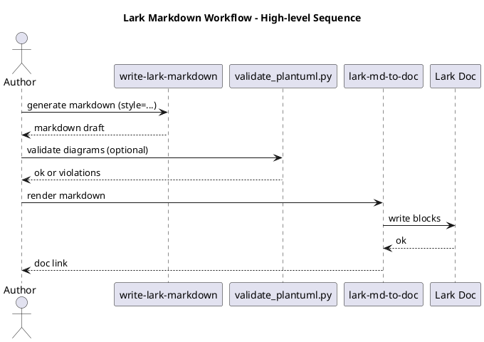

# Howto - Write and Publish Lark Markdown with PlantUML-only Diagrams (Sample)

```callout type=info
## TL;DR
Goal: Use `write-lark-markdown` to produce a Lark-ready Markdown doc with callouts and PlantUML-only diagrams, optionally validate it, then publish via `lark-md-to-doc`.
Time: 10-15 minutes.
Success criteria: The Lark doc is created/updated and all PlantUML diagrams render correctly.
```

## Prerequisites
- `python3` available on PATH
- `lark-cli` installed and authenticated
- You have enabled these skills:
  - `write-lark-markdown`
  - `lark-md-to-doc`
- You have a Markdown file to publish (example: `./doc.md`)

## Quick Start

1) Generate a draft (in chat) using `style=tech-design` or `style=howto`.

2) Save the generated Markdown into `./doc.md`.

3) Validate diagrams (optional but recommended):

```bash
python3 skills-plugins/write-lark-markdown/skills/write-lark-markdown/scripts/validate_plantuml.py --md ./doc.md
```

4) Publish to Lark:

```bash
python3 scripts/render_lark_doc.py --md ./doc.md --title "My Doc"
```

## Step-by-step

1. Choose the writing style
   - `tech-design`: architecture + key flows + rollout.
   - `howto`: executable steps + verification + troubleshooting.
   - `research`: evidence-based recommendation.
   - `proposal`: decision-driving ask.

2. Generate Markdown using `write-lark-markdown`
   - Provide: topic + audience (`exec|eng|mixed`) + any `include_*` switches.

3. Ensure diagrams follow PlantUML-only policy
   - Use only ` ```plantuml` fences.
   - Avoid `!include*`, URLs, and sprites.

4. Validate (optional)

```bash
python3 skills-plugins/write-lark-markdown/skills/write-lark-markdown/scripts/validate_plantuml.py --md ./doc.md
```

5. Publish to Lark

```bash
python3 scripts/render_lark_doc.py --md ./doc.md --title "Doc Title" --folder-token <FOLDER_TOKEN>
```

## Verification

- The doc opens in Lark without missing content.
- Callout blocks render as highlight blocks.
- All PlantUML diagrams render.

```callout type=success
## Verification Checklist
- [ ] Headings rendered correctly
- [ ] Callout blocks rendered correctly
- [ ] PlantUML diagrams rendered correctly
```

## Diagrams (Optional but recommended)

Use a short sequence diagram to communicate the authoring/publishing workflow:



## Notes / Gotchas

```callout type=warning
- Do not use Mermaid; convert to PlantUML.
- Keep PlantUML minimal; avoid `!include` and external resources.
- If the validator reports violations, fix the diagram first (do not publish broken diagrams).
```

## Troubleshooting

- Symptom: Diagram block shows raw text
  - Cause: fence language is not `plantuml`
  - Fix: change to ` ```plantuml` and ensure `@startuml/@enduml` exist

- Symptom: Validator reports forbidden token `https://`
  - Cause: the diagram contains a URL
  - Fix: remove URLs; keep only labels and relationships

- Symptom: Render fails with auth errors
  - Cause: `lark-cli` not logged in or token expired
  - Fix: re-authenticate `lark-cli` and retry

## Rollback / Undo

- If you created a new doc by mistake, delete it from Lark.
- If you appended to an existing doc, revert manually in Lark or restore from a known-good export.

## FAQ

Q: Can I embed images?
A: You can, but keep PlantUML as the source of truth for architecture/flow.
