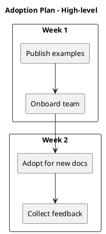

# Proposal - Adopt write-lark-markdown as Team Standard (Sample)

```callout type=info
## Proposal
One-liner: Standardize team docs on `write-lark-markdown` templates with PlantUML-only diagrams and callout-heavy executive summaries.
Decision needed: Approve adoption for all new tech-design docs starting next sprint.
Owner: Dev Productivity (Docs)
```

## Context
- Docs are currently inconsistent; review time is spent on structure rather than content.
- Exec readers want fast context and explicit decisions.
- Diagrams should be diffable and stable in Lark.

## Proposal
- Adopt `write-lark-markdown` as the default skill for writing:
  - `tech-design`, `howto`, `research`, `proposal`
- Enforce PlantUML-only diagrams via:
  - a safe subset (no includes/URLs/sprites)
  - optional validator for Markdown files
- Use callout blocks for TL;DR, risks, and decisions.

## Impact
- Faster doc reviews due to predictable structure.
- Better cross-functional alignment via fixed TL;DR format.
- More reliable diagram rendering.

## Cost & Resources
- 1-2 days to onboard the team (training + templates)
- Optional: migrate top 5 recurring doc types

## Timeline

| Milestone | Date | Owner |
|---|---|---|
| Publish examples + safe subset | 2026-01-20 | MaiFeng |
| Team onboarding session | 2026-01-22 | MaiFeng |
| Start using for new docs | 2026-01-27 | All |
| Collect feedback + adjust v1.1 | 2026-02-03 | MaiFeng |

```callout type=warning
## Risks & Mitigations
- Risk: docs feel too rigid; Mitigation: keep optional sections and audience tuning.
- Risk: partial adoption; Mitigation: promote examples and add a light checklist to reviews.
```

## Ask
- Approve: "PlantUML-only" policy for Lark-facing docs.
- Approve: using `write-lark-markdown` as default starting next sprint.
- Nominate: 1 champion per squad for first-week adoption feedback.

## Diagram (Optional)


