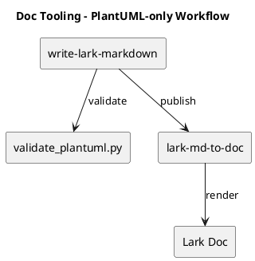

# Research - PlantUML-only vs Mermaid for Lark Docs (Sample)

```callout type=info
## Recommendation
Decision: Use PlantUML-only diagrams for Lark-facing engineering docs.
Why: PlantUML is more diffable and can be constrained via a safe subset; Mermaid introduces rendering and compatibility variance.
Confidence: medium (depends on team familiarity and existing Mermaid footprint).
```

## Research Question
- For Lark doc publishing, should we standardize on PlantUML-only diagrams or allow Mermaid?

## Constraints / Assumptions
- Lark rendering may lag behind upstream diagram tooling versions.
- Docs should be reviewable in code review (diff-friendly).
- Security posture prefers avoiding remote includes and external assets.

## Methodology
- Compare the two options across:
  - Render stability in Lark
  - Reviewability (diff + tooling)
  - Security controls (safe subset enforcement)
  - Author experience
- Use a small internal pilot set:
  - 10 docs (mix of tech-design/howto)
  - 2 weeks observation

## Options Evaluated

| Option | Pros | Cons | Cost | Risk | Notes |
|---|---|---|---|---|---|
| PlantUML-only | Diffable; safe subset enforceable; consistent fences | Some learning curve; style limited by safe subset | Medium | Low | Compatible with `lark-md-to-doc` | 
| Allow Mermaid | Familiar; fast authoring for some | Rendering variance; harder to enforce safe subset | Low | Medium | Requires conversion policy or exceptions |

## Findings
- Render stability:
  - PlantUML can be limited to a known-safe syntax subset.
  - Mermaid may fail depending on renderer support level.
- Reviewability:
  - PlantUML text is reviewable; images are not.
  - Mermaid is also text, but the compatibility surface is harder to control.
- Security:
  - PlantUML supports includes/macros; but we can hard-block them in a validator.
  - Mermaid lacks the same structured “subset enforcement” story in our workflow.

```callout type=warning
## Risks / Uncertainties
- Team already has Mermaid docs; migration cost may be non-trivial.
- If Lark PlantUML renderer behavior changes, our safe subset may need updates.
```

## Diagrams (Optional)

A minimal component diagram for the recommended workflow:



## Next Steps
- Pilot on 10 docs using the `write-lark-markdown` templates.
- Track cycle time and diagram failure rate.
- If adoption is positive, publish v1 writing guidelines and examples.
