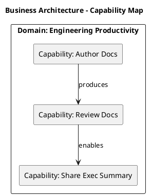
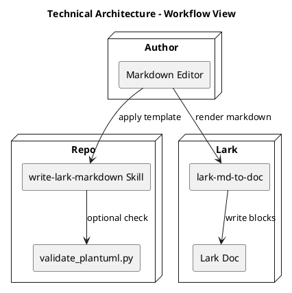
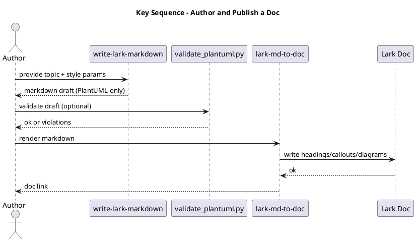
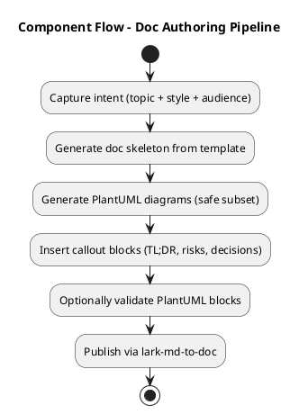

# Tech Design - Standardize Lark Markdown Writing (write-lark-markdown v1)

```callout type=info
## TL;DR

**Conclusion**
Adopt a fixed set of Markdown writing styles (tech-design/howto/research/proposal) with PlantUML-only diagrams and callout-heavy structure. This reduces review friction, improves exec readability, and keeps diagrams diffable and safe to render in Lark.

| Item | Value |
|---|---|
| Owner | Dev Productivity (Docs) |
| Decision Needed | Approve v1 templates + PlantUML safe subset enforcement |
| User/Business Impact | Faster alignment in reviews; fewer rewrites (TBD: measure cycle-time reduction) |
| Engineering Impact | Add new skill + optional validator; no service changes |
| Estimated Cost | 1-2 days to adopt + migrate key docs |
| Timeline | Week 1: rollout in team; Week 2: feedback + v1.1 |
| Key Risks | Over-constraining authors, diagram rendering drift, partial adoption |
| Rollback Strategy | Stop enforcing; keep docs as-is; revert to free-form writing |

**Top Risks**
- Over-constraining authors — Impact: docs feel rigid; Mitigation: keep optional sections + allow per-style density; Rollback trigger: consistent negative feedback from 3+ teams.
- Rendering drift — Impact: diagrams fail to render; Mitigation: conservative safe subset + validator; Rollback trigger: repeated diagram failures in Lark.
- Partial adoption — Impact: mixed doc quality; Mitigation: provide examples + migration checklist; Rollback trigger: no improvement after 2 weeks.
```

## Background
- Current state:
  - Docs vary wildly by author; reviewers repeatedly request the same missing sections (goals, non-goals, risks, rollout).
  - Diagrams are sometimes images or Mermaid, which are harder to diff and may not render consistently.
- Pain points (with evidence):
  - Review cycles are elongated due to structure issues rather than technical issues.
  - Exec readers do not reliably find "what decision is needed".
- Constraints:
  - Must be Lark-friendly.
  - Diagrams must be safe and stable to render.

## Goals / Non-Goals
### Goals
- Provide a consistent structure for common doc styles:
  - `tech-design`, `howto`, `research`, `proposal`.
- Enforce PlantUML-only diagrams with a conservative safe subset.
- Encourage callout blocks for exec readability.

### Non-Goals
- Replacing existing Lark render tooling.
- Auto-generating content from repositories.
- Supporting Mermaid diagrams.

## Architecture

### Business Architecture (Capability Map)



### Technical Architecture



## Key Flows

### Key Sequence (Critical Path)



### Component Flow (Activity)



## Detailed Design
- Styles supported:
  - `tech-design`: fixed TL;DR + 4 required diagrams + optional model/state.
  - `howto`: executable steps + verification + troubleshooting.
  - `research`: evidence-based comparison + recommendation.
  - `proposal`: decision-driving ask + impact/cost/timeline.
- PlantUML policy:
  - PlantUML-only diagrams.
  - Safe subset: forbid `!include*`, URLs, sprites; whitelist minimal `skinparam`.
- Callout policy:
  - `info`: TL;DR and recommendation.
  - `warning/error`: risks, gotchas, rollback triggers.

## Alternatives Considered

| Option | Pros | Cons | Cost | Risk | Decision |
|---|---|---|---|---|---|
| A: Free-form docs (status quo) | Maximum flexibility | Inconsistent, slow reviews | Low | Medium | Rejected |
| B: Mermaid allowed | Familiar to some | Not diffable enough; inconsistent rendering | Low | Medium | Rejected |
| C: PlantUML-only + templates + callouts | Diffable, safe subset enforceable | Requires some learning | Medium | Low | Chosen |

```callout type=warning
## Risks & Mitigations
- Risk: authors bypass templates; Mitigation: provide examples + lightweight validator.
- Risk: template too long; Mitigation: switches for optional sections + audience tuning.
```

## Rollout / Migration Plan
- Phase 0: publish the skill and examples.
- Phase 1: adopt for new tech-design docs.
- Phase 2: migrate top 5 recurring doc types.
- Rollback: stop recommending the skill; keep docs as-is.

## Observability
- Metrics:
  - doc review cycle time (baseline vs after)
  - number of review iterations per doc
  - validator violation rate
- Logs:
  - optional: validator output stored in review comments
- Alerts:
  - not required; this is a writing workflow

## Open Questions
- [ ] Define baseline metrics for "review cycle time" (Owner: MaiFeng, Due: 2026-01-26)
- [ ] Decide whether to require `validate_plantuml.py` in CI for docs (Owner: MaiFeng, Due: 2026-01-30)
